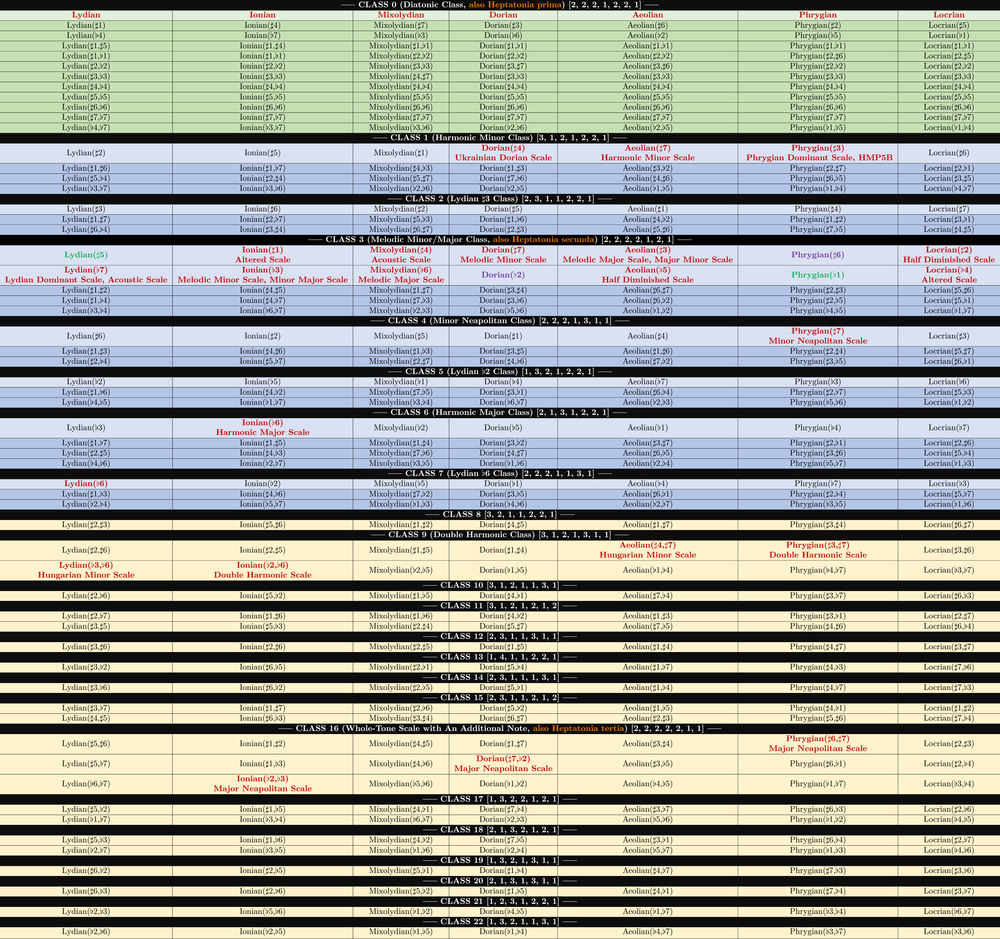

## Heptatonic Scale Classification

This is a little framework which implements some basic music theory classes (`Note`, `Interval`, `DiatonicScale`, `AlteredDiatonicScale`, and `Chord`). They are all engaged in my recent classification work of all **66** kinds of heptatonic scales (only 23 classes are shown in the table below):



#### Examples

At first you should import everything from `theories.py`:

```python
from theories import *
```

Usages of these classes are listed as follows:

1. Using `Note` class:

   ```python
   >>> Note('C1')
   C1
   
   >>> Note('C1').add_flat().add_oct()
   Cb2
   
   >>> Note('D#1').get_vector()
   (2, 1, 1)
   
   >>> Note().set_vector(7, -1, 2)
   Gb2
   
   >>> Note('G1').get_name(show_group=False)
   'G'
   ```

   

2. Using `Interval` class:

   ```python
   >>> Interval('P1')
   P1
   
   >>> Interval('m3').get_vector()
   (3, 2)
   
   >>> Interval().set_vector(4, 2)
   M3
   
   >>> Interval('m7').get_name()
   'm7'
   ```

   Calculation between `Interval`s:

   ```python
   >>> Interval('m3') + Interval('M3')
   P5
   
   >>> Interval('d4') + Interval('A5')
   P8
   
   >>> Interval('A12') - Interval('A4')
   M9
   
   >>> Interval('m2') - Interval('M3')
   -A2
   ```

   

3. Interactions between `Note` and `Interval`:

   ```python
   >>> Note('G1') - Note('C1')
   P5
   
   >>> Note('D2') - Note('G2')
   -P4
   
   >>> Note('G#2') - Note('C1')
   A12
   
   >>> Note('A') - Note('C')
   M6
   ```

   ```python
   >>> Note('G#1') + Interval('M3')
   B#1
   
   >>> Note('G#1') + Interval('m7')
   F#2
   
   >>> Note('Eb1') - Interval('m2')
   D1
   
   >>> Note('C##1') - Interval('-P8')
   C##2
   ```

   

4. Generate a dominant seventh chord using intervals:

   ```python
   >>> M3 = Interval('M3')
   >>> P5 = Interval('P5')
   >>> m7 = Interval('m7')
   >>> print([root, root+M3, root+P5, root+m7])
   [C1, E1, G1, Bb1]
   ```

   

5. Generate a dorian scale using intervals:

   ```python
   >>> key = Note('C')
   >>> m2 = Interval('m2')
   >>> M2 = Interval('M2')
   >>> dorian_intervals = [M2, m2, M2, M2, M2, m2]
   >>> dorian_scale = [key]
   >>> for interval in dorian_intervals:
   ...     dorian_scale.append(dorian_scale[-1]+interval)
   >>> print(dorian_scale)
   [C0, D0, Eb0, F0, G0, A0, Bb0]
   ```

   

6. Using `DiatonicScale` class:

   ```python
   >>> DiatonicScale('C Dorian')
   [C0, D0, Eb0, F0, G0, A0, Bb0]
   
   >>> DiatonicScale('D Ionian').get_name(type_only=True)
   'Ionian'
   
   >>> DiatonicScale('C Ionian').set_tonic('G').get_name()
   'G Mixolydian'
   
   >>> DiatonicScale('C Ionian').add_sharp().get_name()
   'C Lydian'
   
   >>> DiatonicScale('A Locrian').get_interval_vector()
   [1, 2, 2, 1, 2, 2, 2]
   
   >>> DiatonicScale('A Aeolian').get_7th_chord(1)
   [B0, D1, F1, A1]
   
   >>> DiatonicScale('D Dorian').get_full_chord(0)
   [D0, F0, A0, C1, E1, G1, B1]
   ```

   

7. Using `AlteredDiatonicScale` class:

   ```python
   >>> AlteredDiatonicScale('C Ionian(b3)')
   [C0, D0, Eb0, F0, G0, A0, B0]
   
   >>> AlteredDiatonicScale('A HMP5B')
   [A0, Bb0, C#1, D1, E1, F1, G1]
   
   >>> AlteredDiatonicScale('C Ionian(#4, #5)').get_name()
   ['C Lydian(#5)']
   
   >>> AlteredDiatonicScale('C Ionian(b2, #4, #5, #6)').get_name(top_k=2)
   ['C Lydian(#5,#6,b2)', 'C# Phrygian(#6,b1,b2)']
   
   >>> AlteredDiatonicScale('C Dorian(b2)').get_7th_chord(1)
   [Db0, F0, A0, C1]
   ```

   

8. Using `Chord` class:

   ```python
   >>> Chord('C')
   [C0, E0, G0]
   
   >>> Chord('AmM7')
   [A0, C1, E1, G#1]
    
   >>> Chord('Dm7(9, 11, 13)')
   [D0, F0, A0, C1, E1, G1, B1]
    
   >>> Chord('F#dim')
   [F#0, A0, C1]
    
   >>> Chord('A#dim7')
   [A#0, C#1, E1, G1]
    
   >>> Chord('E7(b9)')
   [E0, G#0, B0, D1, F1]
    
   >>> Chord('BbM7+5/C')
   [C-1, Bb0, D1, F#1, A1]
   
   >>> Chord().set_notes(body=[Note('C'), Note('Eb'), Note('Gb'), Note('Bbb')]).get_name()
   'Cdim7'
   
   >>> AlteredDiatonicScale('C Phrygian(#3)').get_full_chord(0).get_name()
   'C7(b9, 11, b13)'
   ```

   
